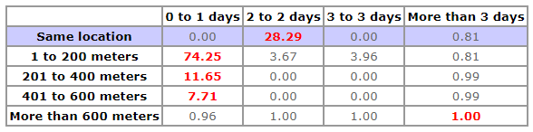

```{r setup, include = FALSE}
knitr::opts_chunk$set(
  collapse = TRUE,
  comment = "#>"
)
```

Currently, the most commonly-used implementation of the Knox test - at least within the criminological literature - is the [Near Repeat Calculator](http://www.cla.temple.edu/center-for-security-and-crime-science/projects/#near-repeat-calculator) (from now on called NRC), which is a freely-available standalone tool. The tool was developed for research purposes, and allows users to apply a version of the Knox test - the same as that which is implemented here - to any set of crime events provided in a specified format. The [manual (PDF)](https://liberalarts.temple.edu/sites/liberalarts/files/NearRepeatsManual.pdf) for the tool provides details of its operation and the nature of the algorithm implemented.

It appears that the results given by the NRC do not match those provided by the code presented here. This may have led to false positives (concluding a near repeat phenomenon exists whereas the data actually do not warrant this conclusion) or false negatives (concluding a near repeat phenomenon does not exist wheres the data suggests otherwise). This vignette demonstrates the inconsistency and outlines a possible explanation.


## tl;dr

- The labels of the NRC software do not match the reported Knox ratios and p-values (and vice versa).
- This may have lead to erroneous conclusions.
- Use `NearRepeat()` to specify the spatial and temporal intervals. Labeling will always be correct, using notation interval.


## Application to test data

The inconsistency is demonstrated via application of the algorithms to the first month of the dataset `chicago_be` distilled from the Crime Open Database[^1], which is already in the required format for the NRC (see `vignette("prepare_data", package = "NearRepeat"` for details). A .csv file of these data can be created by following the steps in vignette "prepare_data".

First, load the `NearRepeat` package.

```{r}
library(NearRepeat)
```

```{r echo = FALSE}
library(NearRepeat)
mydata <- chicago_be[which(chicago_be$date < "2016-02-01"), ]
```

The settings used when applying the NRC - chosen for no particular reason - are as follows:

- Spatial bandwidth: 100 metres
- Number of spatial bands: 3
- Temporal bandwidth: 7 days
- Number of temporal bands: 3
- Significance level: 0.05 (iterations: 20)
- Distance setting: Manhattan

With these settings, the NRC will automatically add a "same location" spatial band as well as "More than 300 meters" and "More than 21 days" bands. Thus, the final table consists of 5 spatial bands and 4 temporal bands (see the table below).

The NRC produces two output files: a 'summary' document in HTML format, containing headline results, and a 'verbose' file in CSV format, which holds the results of intermediate calculations. The latter includes the Observed frequencies distribution, which is essentially the observed contingency table for the underlying data - this contains the number of incident pairs falling within each spatio-temporal band.

For the test data, the **NRC software reports the observed frequencies distribution** as follows:

```{r, echo = FALSE, results='asis'}
mysds <- c(0, 1, 100, 200, 300, Inf)
mytds <- c(0, 7, 14, 21, Inf)

# Create xy matrix
xy <- cbind(mydata$X, mydata$Y)

# Distances of the observed space-time pairs
s_dist <- dist(xy, method = "manhattan")
t_dist <- dist(mydata$date)

# Observed space-time pairs
observed <- table(cut(s_dist, mysds, include.lowest = FALSE, right = FALSE, dig.lab = 10),
                  cut(t_dist, mytds, include.lowest = FALSE, right = FALSE, dig.lab = 10))

mytable <- observed
dimnames(mytable)[[1]] <- c("Same location", "1 to 100", "101 to 200", "201 to 300", "More than 300")
dimnames(mytable)[[2]] <- c("0 to 7", "8 to 14", "15 to 21", "More than 21")

knitr::kable(mytable)
```


## Using `NearRepeat()`

We can attempt to replicate these results using the implementation presented here. The bandwidths are chosen to exactly match NRC's reported output:

```{r}
# Set up the bandwidths
mysds <- c(0, 1, 101, 201, 301, Inf)
mytds <- c(0, 8, 15, 22, Inf)

# The test can now be run (this takes some time):
set.seed(831)
result <- NearRepeat(x = mydata$X, y = mydata$Y, time = mydata$date,
                     sds = mysds, tds = mytds,
                     method = "manhattan", nrep = 20)
```

The observed contingency table is:

```{r, echo=FALSE, results='asis'}
knitr::kable(result$observed)
```

Note that the **labels** match the NRC (although interval notation is used), but the table contents evidently does not. This implies that there is a discrepancy in the calculation of the space-time contingency table between the two methods. Note that this is not due to any stochastic element within the Knox test - the computation of the observed table is purely deterministic.


## Explanation of the discrepancy

After extensive testing, the cause of the discrepancy between the two methods appears to relate to a mismatch between the intervals reported by the NRC and those upon which its calculations are based.

In short, it appears that results that are labelled in the NRC as relating to an interval of '**a to b**' are in fact computed on the basis of the interval '**(a-1) to and including (b-1)**'. For example, a temporal band of '**3 to 4**' days in fact includes incidents that are either 2 or 3 days apart, and does not include incidents that are 4 days apart. In interval notation, that what is labelled in the NRC as '**a to b**' in fact represents the interval **[a-1, b)**.

Although the stochastic nature of the NRC makes it impossible to confirm with certainty, this issue appears to persist in both the 'statistical significance' and 'Knox ratio' tables produced by the NRC; that is, this appears to be the case for the calculator as a whole.


## Pathological examples

A minimal illustration of the issue can be produced by constructing a trivial pathological example. A simple dataset, containing only two incidents, can be constructed as follows:

```{r}
pathological_data <- data.frame(x = c(0, 0),
                                y = c(0, 100),
                                t = as.Date(c("2019/01/01", "2019/01/04")))
```

```{r, echo = FALSE, results='asis'}
knitr::kable(pathological_data)
```

Trivially, there is one pair of events here, with spatial distance 100 metres and temporal distance 3 days.

The NRC was run on this data, firstly with 2 spatial bands of width 200 metres and 2 temporal bands of width 3 days. The NRC gives the following output for the observed contingency table:

```{r, echo = FALSE, results='asis'}
output <- as.table(
  matrix(
    data = c(rep(0,4),0,1,0,0,rep(0,4)), 
    nrow = 4, ncol = 3, 
    dimnames = list(c("Same location", "1 to 200", "201 to 400", "More than 400"),
                    c("0 to 3", "4 to 6", "More than 6"))))

knitr::kable(output)
```

In this case, the single pair has been categorised as falling within the '4 to 6 days' category, although the events are only 3 days apart.

The equivalent issue can also be seen in the spatial dimension: running the same procedure but instead with a spatial bandwidth of 100 metres gives:

```{r, echo = FALSE, results='asis'}
output <- as.table(
  matrix(
    data = c(rep(0,4),0,0,1,0,rep(0,4)), 
    nrow = 4, ncol = 3, 
    dimnames = list(c("Same location", "1 to 100", "101 to 200", "More than 200"),
                    c("0 to 3", "4 to 6", "More than 6"))))

knitr::kable(output)
```

In this case, the spatial separation between the events has been categorised as '101 to 200 metres'.


## Mimicking NRC output

NRC's output can be mimicked in two ways:

### 1. Mimic NRC's labels

The NRC's **labels** can be reproduced as done above, by choosing *slightly different* spatial and temporal intervals than the NRC. These have to be increased by "1" in each case. Then run the standard `NearRepeat()` function. Note that this is exactly what was done earlier in this vignette.

```{r}
mysds <- c(0, 1, 101, 201, 301, Inf)
mytds <- c(0, 8, 15, 22, Inf)

set.seed(831)
result <- NearRepeat(x = mydata$X, y = mydata$Y, time = mydata$date,
                     sds = mysds, tds = mytds,
                     method = "manhattan", nrep = 20)
```

The labels now mirror those of the NRC:

```{r, echo = FALSE, results='asis'}
knitr::kable(result$observed)
```


### 2. Mimic NRC's table contents and calculations

You can also recreate the **table contents** of the NRC, but then with the correct labelling of the rows and columns. Thus, using this method one can fully replicate the numbers in the NRC's tables (and calculations of p-values and such) -- the R package will display the correct row and column labels.

```{r}
mysds <- c(0, 1, 100, 200, 300, Inf)
mytds <- c(0, 7, 14, 21, Inf)

set.seed(831)
result <- NearRepeat(x = mydata$X, y = mydata$Y, time = mydata$date,
                     sds = mysds, tds = mytds,
                     method = "manhattan", nrep = 20)
```

The table *contents* now mirrors that of the NRC, but with *correct* labels:

```{r, echo = FALSE, results='asis'}
knitr::kable(result$observed)
```


## Implications

So what does this matter? For scholarly papers, in the worst case scenario, conclusions drawn will be incorrect. In the best case scenario, the specific reported Knox ratios will, strictly speaking, be incorrect but will not have lead to different overall conclusions.

It becomes trickier when near-repeat findings are translated into policy. For example, a forward-thinking law enforcement agency might use the NRC software to allocate more police officers to an area in the days following a crime event, in the hopes of preventing further crime nearby. I will use data on arsons from Chicago, Illinois, in 2016 to show an example of how this could work. The data are included in the package and accessible via `chicago_arson`, subsetted from the Crime Open Database.

Let's investigate the same repeat and near-repeat pattern of these `r nrow(chicago_arson)` arsons. Suppose we investigate three spatial intervals of 200 meters, and three temporal intervals of 1 day each. Arsons are obviously a bad thing, so police might want to prevent near-repeat arsons by deploying extra officers to the area the day after a first arson.

Using the NRC software with p = 0.01 (100 iterations) and Manhattan distance, one possible outcome[^2] is:



The summary will then read:

> **A significant and meaningful near repeat victimization pattern found!**  
> 
> After an incident, there is evidence of an over-representation of events in the local area for a certain amount of time. There may be crime prevention value in addressing this pattern. Details:
> Within 1 to 200 meters of an initial incident, near repeats are overrepresented for up to 1 days.
> Within 201 to 400 meters of an initial incident, near repeats are overrepresented for up to 1 days.
> Within 401 to 600 meters of an initial incident, near repeats are overrepresented for up to 1 days.
> 
> How big is the difference? In the immediate space-time vicinity to a source event, the most over-represented space-time range that is significant is the zone from 1 to 200 meters and from 0 to 1 days from an initial incident. The chance of another incident is about **7325 percent** greater than if there were no discernible pattern.
> 
> No indication of repeat victimization over-representation found.
> This means that repeat victimization does not appear to cluster in a statistical and influential way immediately after a prior event.

The results seem to provide strong evidence for a same repeat phenomenon 2 days after an arson (Knox ratio of 28.29), as well as very strong evidence for a near repeat pattern on the same day or one day after a previous arson within 1 to 600 meters. Strengthened by these results, a police chief might decide to deploy extra officers the day after a first arson to an area spanning 600 meters surrounding the original arson. After all, the Knox ratios in the nearby bandwidths and 0 to 1 day later are statistically significantly higher than chance (actually they are huge: 74.25, 11.65, and 7.71).

**However, the spatial and temporal labels of the above output are incorrect**. Here are the results using `NearRepeat()`. We specify the bandwidths to mimic the labels of the NRC software:

```{r}
mysds <- c(0, 0.01, 201, 401, 601, Inf)
mytds <- c(0, 1, 2, 3, Inf)

set.seed(63)
result <- NearRepeat(x = chicago_arson$X, y = chicago_arson$Y, time = chicago_arson$date,
                     sds = mysds, tds = mytds,
                     method = "manhattan", nrep = 100)
```

```{r, warning = FALSE, fig.width=4.5, fig.height=4.5}
plot(result)
```

From these results it is clear that the data actually do **not** show evidence of a same repeat pattern after two days, but after just one day. For near repeat patterns, importantly, the biggest Knox ratio of `r round(max(result$knox_ratio), digits = 2)` is found on **the same day** as the first arson. In other words, the first column of the NRC software actually referred to **the same day** rather than "0 to 1 days". After a first arson on Monday, then by Tuesday, when the police is able to allocate extra officers to the surrounding area up to 600 meters, there actually is no evidence of a near-repeat phenomenon.


[^1]: Ashby, M.P.J. (2018). Crime Open Database (CODE). doi: [10.17605/OSF.IO/ZYAQN](https://doi.org/10.17605/OSF.IO/ZYAQN)

[^2]: As there is no way to set the random seed in the NRC software, every run may result in a different outcome. Using exactly the same data in the NRC, you may therefore get somewhat different results.
